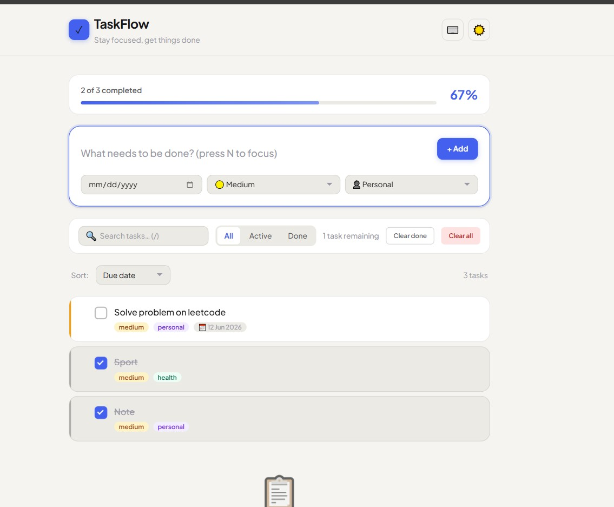
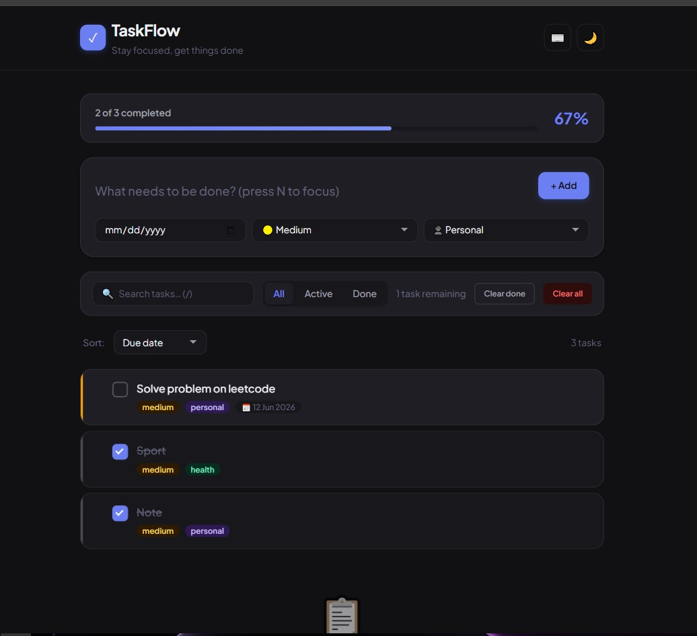

# 📝 Todo App

A powerful, production-quality Todo application built with **pure HTML, CSS, and Vanilla JavaScript** (no frameworks, no libraries). Features modern UI/UX, Local Storage persistence, advanced filtering, search, dark mode, drag-and-drop, keyboard shortcuts, and accessibility-first design.

# 📝 Light mode



# 📝 Darkmode




---

## 🌟 Features

### Core Features
- ✅ **Add Task** – Create new tasks with description
- ❌ **Delete Task** – Remove tasks with confirmation dialog
- ✏️ **Edit Task** – Update task description, due date, priority, or category
- ✔️ **Mark Completed** – Toggle task completion status
- 🔁 **Unmark Completed** – Restore completed tasks to active
- 📊 **Task Count** – Display "X tasks left" (active tasks only)
- 🗑️ **Clear All** – Remove all tasks (with confirmation)
- 🧹 **Clear Completed** – Remove only completed tasks

### Advanced Features
- 💾 **Local Storage Persistence** – Tasks saved automatically, survive page reload
- 🔍 **Search Tasks** – Real-time search by description
- 🎯 **Filter Tasks** – All / Active / Completed
- 📅 **Due Dates** – Set and display due dates with formatted output
- ⚡ **Priority Levels** – High (red), Medium (orange), Low (green)
- 📂 **Task Categories** – Personal, Work, Study, Shopping
- 🌙 **Dark Mode** – Toggle between light and dark themes
- 📱 **Responsive Design** – Mobile-friendly (works on phones, tablets, desktop)
- ⌨️ **Keyboard Shortcuts** – Navigate and act without mouse
- 📭 **Empty State UI** – Encouraging message when no tasks exist
- 🔒 **Confirmation Dialogs** – Prevent accidental deletions
- 💬 **Toast Notifications** – User feedback for actions
- 🖱️ **Drag and Drop** – Reorder tasks by dragging

### UI/UX Highlights
- 🎨 Modern, professional layout with smooth animations
- 🎯 Professional color palette (custom CSS variables)
- ✨ Hover effects and transitions on all interactive elements
- 🛡️ Accessible design (ARIA labels, keyboard navigation, focus states)
- 📐 Proper spacing, typography hierarchy, and visual balance
- 🌈 Priority badges and category tags for visual organization

---

## 🏗️ Architecture

### Folder Structure

### Component Breakdown

| Module | Responsibility |
|--------|----------------|
| `AppState` | Central state store (tasks, filters, search, UI state) |
| `AppStorage` | Local Storage save/load/clear operations |
| `AppTasks` | CRUD operations for tasks (add, delete, update, complete) |
| `AppFilters` | Filter logic (all/active/completed) |
| `AppSearch` | Search logic (real-time filtering by description) |
| `AppUI` | Render tasks, update counts, show/hide empty state, toast notifications |
| `AppEvents` | Bind event listeners to DOM elements |
| `AppShortcuts` | Keyboard shortcut handlers |
| `AppDragDrop` | Drag-and-drop reordering logic |

### Development Order

1. **Setup** – Folder structure, HTML skeleton
2. **Base** – CSS variables, reset, typography
3. **State** – `AppState` and data structure
4. **Storage** – Local Storage module
5. **CRUD** – Add, delete, update, complete tasks
6. **UI** – Render tasks, empty state, task count
7. **Filters** – All/Active/Completed filtering
8. **Search** – Real-time search
9. **Features** – Due dates, priority, categories
10. **Themes** – Dark mode toggle
11. **Responsive** – Mobile breakpoints
12. **Shortcuts** – Keyboard navigation
13. **Notifications** – Toast messages
14. **Drag-Drop** – Task reordering
15. **Polish** – Animations, accessibility, best practices

---

## 🚀 Getting Started

### Prerequisites

- Any modern browser (Chrome, Firefox, Safari, Edge)
- No build tools, no Node.js, no dependencies required

### Installation

1. **Clone or download this repository**
   ```bash
   git clone https://github.com/YourUsername/todo-app.git
   cd todo-app
   ```

2. **Open the app**
   - Simply open `index.html` in your browser
   - Or use a local server:
     ```bash
     # Using Python
     python3 -m http.server 8000
     
     # Using Node.js (if you have http-server)
     http-server -p 8000
     ```
   - Visit `http://localhost:8000`

### Usage

1. **Add a task**
   - Type in the input field
   - Optionally set due date, priority, and category
   - Click "Add Task" or press `Enter`

2. **Complete a task**
   - Click the checkbox next to the task

3. **Edit a task**
   - Click the ✏️ edit button
   - Modify description, due date, priority, or category
   - Save changes

4. **Delete a task**
   - Click the 🗑️ delete button
   - Confirm deletion in the dialog

5. **Filter tasks**
   - Click "All", "Active", or "Completed" buttons

6. **Search tasks**
   - Type in the search box to filter by description

7. **Toggle dark mode**
   - Click the ☀️/🌙 button in the header

8. **Drag and drop**
   - Click and hold a task to drag it
   - Release to drop at new position

9. **Keyboard shortcuts**
   - `N` – New task (focus input)
   - `S` – Focus search box
   - `D` – Toggle dark mode
   - `Esc` – Close modal/dialog

---

## 🧪 Testing

### Manual Testing Checklist

- ✅ Add task with all options (due date, priority, category)
- ✅ Add task with minimal input (just description)
- ✅ Delete task (with confirmation)
- ✅ Edit task (all fields)
- ✅ Mark/unmark completed
- ✅ Filter: All / Active / Completed
- ✅ Search: unique text, partial match, no match
- ✅ Clear all tasks (with confirmation)
- ✅ Clear completed tasks
- ✅ Persistence: reload page, tasks still exist
- ✅ Dark mode: toggle, persists on reload
- ✅ Responsive: test on mobile, tablet, desktop
- ✅ Keyboard shortcuts: all work
- ✅ Drag and drop: reorder tasks
- ✅ Empty state: shows when no tasks
- ✅ Toast notifications: appear for actions
- ✅ Accessibility: keyboard navigation, focus states, ARIA labels

### Edge Cases Handled

| Edge Case | Handling |
|-----------|----------|
| Empty description | Validation error, not added |
| Description < 3 chars | Validation error, not added |
| Invalid date format | Stored as null, no error |
| No tasks to clear | Button disabled, no action |
| Storage disabled | Fallback to memory, toast warning |
| XSS attempt in description | HTML escaped before display |

---

## 🎨 Design System

### Color Palette

#### Light Mode
- **Primary**: `#6366f1` (indigo)
- **Success**: `#10b981` (green)
- **Warning**: `#f59e0b` (orange)
- **Error**: `#ef4444` (red)
- **Background**: `#f8fafc` (light gray)
- **Text**: `#1e293b` (dark gray)

#### Dark Mode
- **Primary**: `#818cf8` (lighter indigo)
- **Background**: `#1e293b` (dark gray)
- **Text**: `#f1f5f9` (light gray)

*(All colors defined in `css/variables.css` as CSS custom properties)*

### Typography

- **Font Family**: `Inter`, system fonts
- **Sizes**: `0.75rem` (xs) to `2rem` (3xl)
- **Line Height**: `1.25` (short), `1.5` (normal), `1.75` (loose)

### Spacing

- **Scale**: `0.25rem` (xs) to `3rem` (2xl)
- **Consistent**: All margins/paddings use scale values

### Animations

- **Fast**: `150ms` (hover, focus)
- **Normal**: `250ms` (transitions)
- **Slow**: `350ms` (keyframe animations)

---

## 🛡️ Best Practices Implemented

### Code Quality
- ✅ **Single Responsibility**: Each file handles one concern
- ✅ **Modular Architecture**: Separated by feature (tasks, filters, search, UI)
- ✅ **No Global Mutations**: State updated via helper functions
- ✅ **Error Handling**: All storage operations have try/catch
- ✅ **Validation**: Input validated before adding tasks
- ✅ **XSS Prevention**: HTML escaped before display

### UI/UX
- ✅ **Accessibility**: ARIA labels, keyboard navigation, focus states
- ✅ **Responsive**: Works on all screen sizes
- ✅ **Consistent**: Design system with CSS variables
- ✅ **Feedback**: Toast notifications for user actions
- ✅ **Prevention**: Confirmation dialogs for destructive actions

### Performance
- ✅ **No Dependencies**: Pure vanilla JavaScript (fast)
- ✅ **Minimal DOM Manipulation**: Only update what changes
- ✅ **CSS Variables**: Efficient theme switching
- ✅ **Local Storage**: Fast persistence (no network)

---

## 🤝 Contributing

Contributions are welcome! Here's how to contribute:

1. **Clone the repository**
   ```bash
   git clone https://github.com/YourUsername/todo-app.git
   ```

2. **Create a branch**
   ```bash
   git checkout -b feature/your-feature-name
   ```

3. **Make your changes**
   - Follow existing code style
   - Add tests for new features
   - Update documentation if needed

4. **Submit a pull request**
   - Describe your changes clearly
   - Link related issues
   - Wait for review

### Coding Guidelines

- Use **ES6+** syntax (no transpilation needed)
- Follow **existing file structure** (separate by concern)
- Use **CSS variables** for all colors, spacing, typography
- Add **ARIA labels** for accessibility
- Write **clear comments** for complex logic
- Test on **multiple browsers** before submitting

---

## 📄 License

This project is open source and available under the [MIT License](LICENSE).

---

## 🙏 Acknowledgments

- Built with **pure HTML, CSS, and Vanilla JavaScript**
- No frameworks, no libraries, no build tools
- Inspired by modern productivity apps
- Designed for learning and production use

---

## 📬 Contact

- **Author**: Lemi Fayera
- **Location**: Bishoftu, Oromiya, ET
- **Repository**: [github.com/YourUsername/todo-app](https://github.com/YourUsername/todo-app)
- **Issues**: [Report an issue](https://github.com/YourUsername/todo-app/issues)

---

## 🎯 Roadmap

### Future Enhancements (Post-MVP)

- 📊 **Statistics Dashboard** – Task completion rate, average time to complete
- 🔄 **Sync** – Cloud sync across devices (Firebase, Supabase)
- 📧 **Notifications** – Email/push notifications for due dates
- 🗂️ **Folders** – Group tasks into folders
- 🔀 **Templates** – Reusable task templates
- 📈 **Analytics** – Weekly/monthly task reports
- 🌐 **Internationalization** – Multi-language support

---

**Built with ❤️ using only HTML, CSS, and Vanilla JavaScript**